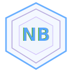

<div align="center">

<div></div>

<div></div>

# NovaByte OS

**A browser-based operating system with multi-version support,**
**Nova Core Services, and an independent security update pipeline.**

<br>

[](https://github.com/NovaByteTeam/novabyte-os)
[](https://github.com/NovaByteTeam/novabyte-os)
[](https://github.com/NovaByteTeam/novabyte-os)
[](https://nodejs.org)
[](https://github.com/NovaByteTeam/novabyte-os)
[](https://github.com/NovaByteTeam/novabyte-os/tree/main/NBOSP)

<br>

[**Close-Source Notice**](#-close-source-announcement--23052026) · [**BuildScript**](#-nbosp-buildscript--close-source-your-own-project) · [**Download v3**](#-download) · [**NBOSP**](#-nbosp--novabyte-open-source-project) · [**NovaByte Services**](#-novabyte-services--licensing) · [**Update System**](#-update-system) · [**Nova Core Services**](#-nova-core-services) · [**Your Privacy**](#-your-privacy-comes-first) · [**Privacy & No Telemetry**](#-privacy--no-telemetry--fully-verified) · [**Security**](#-security) · [**Versions**](#-versions)

</div>

-----

## 🛡 Your Privacy Comes First

Privacy is not a feature we added. It is a principle we built around.

Most software treats your data as a side effect — something that leaks out as you use it, collected quietly, rarely explained. We built NovaByte to work the opposite way. Every part of the OS that touches the outside world has been designed so that as little as possible leaves your machine, and what does leave is never yours.

**No external dependencies out of the box** — NovaByte ships fully self-contained. There are no calls to CDNs, no fonts loaded from Google, no icons pulled from third-party servers. Everything the OS needs to run is bundled locally. From the moment you launch it, nothing loads from anywhere you did not explicitly navigate to.

**The browser protects you silently** — favicon requests, search suggestions, and email images are all routed through a remote relay server (open source, auditable at github.com/NovaByteOfficial/suggest-relay) so Google, search engines, and email sender tracking servers see the relay's IP, never yours. On top of that, Chromium-specific fingerprinting headers are stripped, results are cached server-side, and tracker scripts and pixels are blocked at the network level using the Disconnect.me blocklist before any connection is made. If the relay is unreachable, requests fall back to direct — suggestions still work, just without IP masking. For full IP privacy on actual browsing, use a VPN. The experience looks identical to a normal browser. The difference is what the other side never receives.

**The email client is private by design** — opening an email in most clients silently tells the sender you read it, when you read it, and roughly where you are. NovaByte removes all of that. Remote images are proxied server-side so your IP never reaches a sender's tracking server. Known tracker pixels are blocked entirely — the server returns a blank placeholder without making any upstream request, so the sender gets no signal whatsoever. CSS-embedded trackers, redirect link wrappers, and tracking query parameters are all stripped before the email renders. You see the email exactly as intended. The sender sees nothing.

**Verifiable, not promised** — NBOSP is fully open source. You do not have to trust any of this — you can read every line. If we say something does not phone home, the code is there to confirm it.

-----

## 🔏 Close-Source Announcement — 23/05/2026

> [!IMPORTANT]
> **After a long time of waiting and planning, we finally closed the source of NovaByte OS on 23 May 2026.**

We’ve wanted to do this for a while, and we finally made it happen. Here’s what that means technically and what you should know before poking around the release files:

### How We Did It

We closed the source using a combination of three layers of protection:

- **JavaScript obfuscation** — all JS logic has been heavily obfuscated before packaging
- **NW.js (Node-Webkit)** — the app is packaged as a native desktop executable via NW.js, keeping the runtime internals away from plain browser inspection
- **V8 bytecode compilation** — source files have been compiled to V8 bytecode, meaning what ships is pre-compiled engine output, not readable JavaScript

On top of that, **the full git commit history has been wiped.** There is no history to browse, diff, or trace.

### app.bin

All core OS logic lives in `app.bin`. This file is compiled bytecode — it is completely unreadable as source code and is not practically reversible. Do not attempt to reverse engineer or deobfuscate `app.bin`. It is not possible to recover meaningful sources from it, while nothing in the world is ever unattackable, but it’s like near impossible since it’s a thing that only Chromium understands, and every Chromium update changes, which makes attacks way too hard, and attempting to recover it is a violation of our terms.

### index.html

**`index.html` is now 256 AES-GCM-SIV encrypted.** Half of the key is bundled into `server.js` and the other half lives in `app.bin`, so `index.html` now gets real protection instead of just being a plain shell.

### style.css

**`style.css` is also now 256 AES-GCM-SIV encrypted.** Just like `index.html`, the key is split between `server.js` and `app.bin`, giving the stylesheet the same protection layer.

### HTML / CSS Encryption

We’ve replaced the old base64 + gzip approach for these files with **256 AES-GCM-SIV encryption**. The encryption key is split in two: one half is bundled into `server.js`, and the other half is embedded in `app.bin`. That means `index.html` and `style.css` are now getting real protection. See the BuildScript below for how we did it.

-----

## 📦 NBOSP BuildScript — Close Source Your Own Project

If you want to close source your own NBOSP-based project the same way we did, we’ve uploaded our **build script** to this repo’s Releases under the tag:

> **`BuildScript`**

**→ [Download the BuildScript from Releases](https://github.com/NovaByteTeam/novabyte-os/releases/tag/BuildScript)**

It handles the full pipeline: JS obfuscation, V8 bytecode compilation, NW.js packaging, and the base64+gzip HTML encoding step. Use it as a starting point for your own close-source build.

-----

## ⬇️ Download

> [!IMPORTANT]
> **v1, v2, and v3 source code is fully closed source and has been removed from this repository.**
> The compiled v3 executable is available via GitHub Releases.

**→ [Download NovaByte OS v3 (Latest Release)](https://github.com/NovaByteTeam/novabyte-os/releases/latest)**

Download the `.zip`, extract it, and run the exe. No installation required.

-----

## 🆓 NBOSP — NovaByte Open Source Project

The `NBOSP/` folder in this repo is the **free, open, no-strings-attached base of NovaByte**.

> **Who is NBOSP for?** Developers and people who want to run NovaByte daily — those who just want pure stock software. No bloat, no fluff, no extras. Just a minimal, super fast, and clean OS that gets out of your way.

> [!WARNING]
> **NBOSP is a foundation, not a finished product. Read this before you download.**
>
> A large codebase does not mean feature-rich. NBOSP has thousands of lines of code — most of that is OS infrastructure, security, routing, server logic, and plumbing. **The apps and user-facing features are intentionally bare bones.** Each app does the basics and stops there. No advanced functionality, no rich settings, no polish you would expect from a commercial OS. If you open Files you can browse files. If you open Music you can play a track. That is roughly the level across the board.
>
> **This is by design.** NBOSP is the raw skeleton — the base you fork and build on top of. It is not competing with v3 or any consumer OS on features. If you want a fully featured NovaByte OS, download v3 from [Releases](https://github.com/NovaByteTeam/novabyte-os/releases/latest).

- Do whatever you want with it — copy it, fork it, sell it, modify it, redistribute it
- No rules, no license restrictions — but attribution is required, so preserve copyright notices and the license text
- This is pure NovaByte.
- Basic security (rate limiting, CSRF protection, security headers) is built in
- No edition system, no update pipeline, and no telemetry
- The NBOSP apps are stock versions — pure NovaByte apps that we replaced with our own feature-heavy versions in v3. We took NBOSP and built on top of it with an update system and many more features.
- We maintain two separate app lines: NBOSP apps and our own full-featured apps.
- The NBOSP apps are feature-frozen — we are not adding new features or making interface changes to them, but compatibility, bug, and security fixes continue as always.
- NBOSP itself (the OS) is **not abandoned** — we will keep shipping fixes and anything new we can. It won't always be exciting or frequent, but we're not done. We actually ship fixes faster than v3 — the codebase is small and easy to maintain.
- All listed apps are built specifically for NBOSP and are free to use, customise, or modify however you like.

### 📱 What the NBOSP Apps Actually Do

These are the **actual features pulled directly from the source code** — not guesses based on the app name. The codebase is large but most of that is OS infrastructure (VFS, security, routing, workers). The apps themselves are minimal.

|App|What it actually does|
|:--|:--------------------|
|📁 **NBOSP Files**|Icon grid and list view. Sort by name, size, type, or modified date. Back/up navigation with a path bar. Search within the current folder. New file/folder, copy, cut, paste, rename (F2), move to trash, restore, permanent delete. Multi-select (Ctrl+A). Drag-and-drop file import. Keyboard shortcuts. **No tabs, no split panes, no cloud sync, no bulk rename.**|
|📝 **NBOSP TextEdit**|Plain text editor. Line numbers, status bar showing line/column/word count, Tab indentation, auto-close brackets, Save/Save As to the VFS. Ctrl+S to save. Word count via context menu. **Single file at a time only — no file list, no tabs, no rich formatting, no markdown preview.**|
|💻 **NBOSP Terminal**|A real shell emulator with a working command set: `ls`, `cd`, `cat`, `grep`, `cp`, `mv`, `rm`, `mkdir`, `find`, `diff`, `wc`, `sort`, `head`, `tail`, `echo`, `env`, `export`, `alias`, `history`, `ps`, `neofetch`, and more. Pipe chains, `&&`/`||`/`;` chaining, output redirect (`>`), tab autocomplete, command history, custom aliases, shell variables, multiple tabs (Ctrl+Shift+T). **All commands run against the VFS — not a real system shell.**|
|🌐 **NBOSP Browser**|NW.js WebView with real site rendering. Tabs, bookmarks, history, incognito mode, find-in-page (Ctrl+F), zoom controls, mobile/desktop user-agent toggle, popup blocker, per-tab WebView/iframe mode toggle. Privacy relay routes suggestions and favicons through a remote relay. See the [browser section](#-nbosp-browser--now-powered-by-nwjs--webview) for full details. **No extensions, no sync, no password manager.**|
|📅 **NBOSP Calendar**|Month, week, day, and agenda views. Mini calendar sidebar. Upcoming events list. Create/edit/delete events with title, date, start/end time, description, and colour. Navigate prev/next/today. **No recurring events, no reminders/notifications, no calendar sync (Google, Outlook, etc.).**|
|📧 **NBOSP Email**|Multi-account IMAP/POP3/Exchange. Sidebar with Inbox, Sent, Drafts, Trash, Spam, Archive, Starred. Search, compose, reply, forward, batch-select, pagination. Full privacy pipeline: tracker pixel blocking, CSS tracker stripping, link unwrapping, tracking parameter removal, script sandboxing. **No filters/rules, no tags, no offline cache.**|
|🖼 **NBOSP Gallery**|Scans the VFS for image files and shows them in a grid. Lightbox viewer with prev/next navigation, filename caption, and keyboard support (arrow keys, Escape). **No editing, no albums, no metadata, no sorting — just a viewer.**|
|⬇️ **NBOSP Downloads**|Displays files saved from the browser: name, size, date, and status badge (done/downloading/failed). Remove individual items or clear all completed. Live-updates via a global `Downloads.add()` API. **No download queue controls, no pause/resume, no browser integration for in-progress downloads.**|
|👤 **NBOSP Contacts**|Add/edit/delete contacts with name, email, phone, and notes fields. Alphabetically sorted list. Search by name, email, or phone. Avatar initials. **No groups, no import/export (vCard, CSV), no photo support.**|
|🔍 **NBOSP Search**|System-wide search across files (by filename), contacts (name/email/phone), and the downloads list. Clicking a result opens the relevant app. Up to 8 results per section. **Filename matching only — no full-text/content search inside files.**|
|🕐 **NBOSP Clock**|Four tabs: analog+digital clock with date display; alarms with custom time, label, and day-of-week repeat (toggle on/off per alarm); countdown timer with H/M/S input, start/pause/reset; and stopwatch. **No world clock, no multiple time zones.**|
|⚙️ **NBOSP Settings**|Appearance (7 themes: Nova Dark, Nova Light, Nord, Dracula, Catppuccin, Tokyo Night, Gruvbox; accent colour picker; 12/24h clock toggle), System (change username), Storage, Privacy, Desktop, Accessibility, About. **Settings are thin — each section has a handful of toggles, not deep configuration panels.**|
|🖩 **NBOSP Calculator**|Standard arithmetic with live expression preview. Supports `+`, `-`, `*`, `/`, `%`, parentheses, and decimal input. Backspace, clear, keyboard support. **No scientific mode, no history, no unit conversion.**|
|📦 **NBOSP App Manager**|Install `.novaapp` packages from disk. Manage web apps (add by URL). Pin/unpin apps to the taskbar. Enable/disable installed apps. Set apps to auto-launch on boot. Install log. **No app store/catalogue, no update management, no package signing verification in the UI.**|

> **Want the full-featured NovaByte OS?** Download the compiled v3 from [Releases](https://github.com/NovaByteTeam/novabyte-os/releases/latest). NBOSP is just the foundation — the base code you build on.

> [!NOTE]
> **Versioning:** NBOSP and v3 share the same version numbering format. The only difference is the product name prefix:
> - NBOSP releases are named **NovaByte 3.0.2** (no "OS")
> - v3 releases are named **NovaByte OS 3.0.2**
>
> The version numbers themselves are identical and stay in sync.

### 🔄 NBOSP App Updates

NBOSP does **not** use the built-in System Updates app. Updates to NBOSP apps depend entirely on your **forker or maintainer**.

If NovaByte fixes or improves something in the NBOSP source, that fix lives in the upstream repo. Your fork does not receive it automatically. Your forker or maintainer has to pull the change, repackage it, and release their own updated build.

|Update type                                |How you get it                                           |
|-------------------------------------------|---------------------------------------------------------|
|NBOSP app fix from upstream NovaByte       |Forker/maintainer repackages → you re-clone their release|
|NBOSP app fix from your own fork maintainer|Forker/maintainer releases → you re-clone                |
|v3 built-in app fix                        |System Updates app → click Update → done                 |

### 🌐 NBOSP Browser — Now Powered by NW.js & WebView

**MASSIVE UPDATE (May 2026):** NBOSP Browser has been completely rebuilt using **NW.js (Node-Webkit)** as the rendering engine with **WebView** support, replacing the previous iframe + Ultraviolet proxy architecture.

#### What Changed

**Old approach (iframe + Ultraviolet proxy):**

- The browser was completely broken — unable to properly browse most websites
- UV proxy returning 400 and Bad Request errors
- Cookie support broken, tab switching issues
- Email app limited by iframe isolation

**New approach (NW.js + WebView):**

- ✅ Native browser rendering with full site compatibility
- ✅ Cookie support now fully functional
- ✅ Tab switching works reliably
- ✅ Email app now uses webview — all iframe limitations removed
- ✅ All UV proxy errors completely eliminated
- ✅ Everything “just works” out of the box

#### New Features in NBOSP Browser (Minor updates may still follow)

- **Privacy Relay** — search suggestions, favicons, and email images are all routed through a remote open source relay (`https://suggest-relay.onrender.com`) so Google, search engines, and email tracking servers see the relay's IP, never yours. Fingerprinting headers are stripped on all relay requests. Falls back to direct if the relay is unreachable. Relay code is auditable at github.com/NovaByteOfficial/suggest-relay. For full IP privacy on actual browsing, use a VPN.
- **Bookmarks** — Save and organize your favorite websites
- **History** — View and quickly access previously visited pages
- **Find in Page** — Search for text within a page using Ctrl+F
- **New Incognito Tab** — Browse privately without recording history
- **Mobile/Desktop Site Toggle** — Switch between mobile and desktop user agent
- **Zoom Controls** — Adjust page zoom (In, Out, Reset)
- **Dialup Page** — Classic retro homepage for quick access to common sites
- **iFrame / Webview Mode Toggle** — Switch between NW.js WebView and sandboxed iFrame mode per tab
- **Popup Blocker (fixed)** — Blocks intrusive popups while allowing OAuth and login flows through

#### Automatic Startup

Running `npm start` in the NBOSP folder now automatically opens the OS window. No manual browser navigation needed.

-----

## 🔑 NovaByte Services — Licensing

> [!CAUTION]
> **NovaByte Services are not free to bundle. They require explicit permission and a license from us.**

> [!IMPORTANT]
> **NovaByte Services are not available to individuals or the general public. Licenses are only issued to developers who are actively building and capable of releasing a full consumer operating system.**

NovaByte Services includes:

- **Nova Core Services** — the independent security update pipeline
- **NovaBridge** — REST/WebSocket transport, OAuth flows, and real-time sync
- **Sentinel Security System** — the full security runtime, privacy engine, and threat detection
- **System Updates app** — the built-in app update pipeline
- **NovaByte Edition System** — edition management and feature sets
- **NovaByte Proprietary Apps** — closed-source, fully-featured apps built by NovaByte (see below)
- **Any other service, API, or system component developed by NovaByte** that is not part of NBOSP

### 📱 NovaByte Proprietary Apps

NovaByte Services includes a suite of **closed-source, proprietary NovaByte apps**. These are not open source and are not part of NBOSP.

> [!IMPORTANT]
> **Any NovaByte Services license requires bundling Horizon Browser and NovaMail alongside your own browser and email apps. These are not replacements — both your apps and ours must ship together. Additional NovaByte apps are optional.**

#### Required Alongside Your Own Apps

These two apps **must be bundled** in any NovaByte Services-licensed OS, shipping **alongside** the licensee's own browser and email client:

| App | Description |
|-----|-------------|
| 🌐 **Horizon Browser** | NovaByte's proprietary browser. Must ship alongside your own browser. Includes advanced privacy protections, tracker blocking via the Disconnect.me blocklist, remote relay routing for search suggestions, favicons, and email images (upstream services see the relay's IP, not the user's), per-tab webview/iframe mode, bookmarks, history, incognito tabs, find-in-page, zoom controls, popup blocker, and mobile/desktop site toggling. |
| 📧 **NovaMail** | NovaByte's proprietary email client. Must ship alongside your own email app. Includes full multi-layer privacy protection — tracker pixel blocking, CSS tracker stripping, link unwrapping, tracking parameter removal, and full script sandboxing. |

#### Optional Apps (choose any)

Beyond the two required apps, you may choose to include any of the following:

| App | Description |
|-----|-------------|
| 🎵 **Resonance** | Music and audio player |
| 🖼 **Prism** | Image viewer and media gallery |
| 🛒 **Marketplace** | App store |
| 🎨 **PixelDrop** | Notes App |
| 📄 **Lumina** | Document viewer and PDF reader |
| 🛡 **NovaSentinel** | Security dashboard and threat monitoring |
| 🔐 **Encryption Vault** | Key generation app with military-grade types |
| 🖩 **Calc+** | Advanced calculator |
| 🕐 **NovaClock** | Clock, alarms, timers, and world time |

You may not modify or redistribute NovaByte proprietary apps outside the terms of your NovaByte Services license.

### Who Can Apply

Licenses are **only** considered for developers or teams who:

- Are building a **full consumer-facing operating system**
- Are capable of **releasing and maintaining** that OS to real end users
- Can demonstrate the scope and seriousness of their project

**Personal projects, experiments, hobby builds, and individual use cases do not qualify — no exceptions.**

### How to Get a License

If you meet the above criteria and want to bundle NovaByte Services into your OS:

1. **Contact us** — reach out and describe your OS, your team, and what services you want to use
1. **We review your request** — we assess whether your project qualifies
1. **If approved**, we issue a license with specific terms for your use case
1. **You must comply** with all conditions set in your license

**No permission = no bundling. There are no exceptions.**

> We built these services from the ground up for a serious OS product. If you’re building something at that level and want them in your product, reach out. NovaByte Services are not available to individuals or anyone outside of that scope — permission is required, and not everyone will get it.

-----

## 🔒 Repository Notice — v1, v2, and v3

> [!CAUTION]
> **NovaByte OS v1, v2, and v3 source code is fully closed source.**
> **It has been completely removed from this repository.**
> **Git commit history has been wiped. There is no history to inspect.**
> The source is not available. The compiled v3 executable is available via [GitHub Releases](https://github.com/NovaByteTeam/novabyte-os/releases/latest).

The close-source build uses JavaScript obfuscation, V8 bytecode compilation, NW.js packaging, and AES-GCM-SIV encryption for `index.html` and `style.css`. The encryption key is split between `server.js` and `app.bin`. All OS logic is compiled into **`app.bin`** — do not attempt to reverse engineer or deobfuscate it. **`index.html`** and **`style.css`** are protected assets, not plain source files. See the [Close-Source Announcement](#-close-source-announcement--23052026) section for full details.

You are **not permitted** to:

- fork and redistribute them,
- modify and ship derivatives,
- create custom builds from them,
- or use them as a base for another OS

without explicit permission from the NovaByte team.

If you want a freely buildable base, use `NBOSP/` instead.

-----

## ⚠️ Deprecation Notice: NovaByte OS 1.x.x

> [!WARNING]
> **NovaByte OS 1.x.x has reached End of Life and is no longer supported.**
> 
> |                        |Status                                  |
> |------------------------|----------------------------------------|
> |OS security patches     |❌ No further patches                    |
> |New features            |❌ No backports                          |
> |OS-level vulnerabilities|❌ Devices are exposed and unpatched     |
> |Nova Core Services      |✅ Partial service-level patches continue|
> 
> **→ Upgrade to NovaByte OS 3.x.x:** download from [Releases](https://github.com/NovaByteTeam/novabyte-os/releases/latest)

-----

## 📋 Versions

> [!NOTE]
> **Versioning naming:** NBOSP and v3 use the same version number format. NBOSP releases are named **NovaByte 3.x.x** and v3 releases are named **NovaByte OS 3.x.x** — the numbers are identical, only the product name prefix differs (e.g. `NovaByte 3.0.2` = `NovaByte OS 3.0.2`).

|Version    |Status       |Last OS Patch|Core Services|Notes                                                                 |
|-----------|:-----------:|:-----------:|:-----------:|----------------------------------------------------------------------|
|**v1.8.21**|🔴 End of Life|2026-04-01   |✅ Active     |Final 1.x release, deprecated                                         |
|**v2.x.x** |🟡 Maintenance|Active       |✅ Active     |Stable, receiving security patches                                    |
|**v3.x.x** |🟢 Current    |Active       |✅ Active     |Latest version, recommended — includes built-in **System Updates** app|

-----

## 🚀 Getting Started

### Running NBOSP

```bash
git clone https://github.com/NovaByteTeam/novabyte-os.git
cd novabyte-os/NBOSP
npm install
npm start
```

The window opens automatically — no manual browser navigation needed.

**On first launch, two things happen automatically:**

- A `.env` file is generated with a secure random `SESSION_SECRET` and sensible defaults. Fill in any API keys you need afterwards — the server starts without them.
- A local HTTPS certificate and CA are generated. A native OS prompt will appear asking you to trust the CA — click **Yes** (Windows) or enter your password (macOS/Linux). This only happens once. After that, the app opens over HTTPS with no browser warnings, permanently.

### Running v3

Download the compiled exe from [Releases](https://github.com/NovaByteTeam/novabyte-os/releases/latest), extract the zip, and run it. No Node.js or cloning required.

-----

## 🗂 Repository Structure

```
novabyte-os/
├── NBOSP/                           # NovaByte Open Source Project (free, no rules)
│   ├── index.html
│   ├── server.js
│   ├── client.js
│   ├── js/
│   ├── assets/
│   └── LICENSE
├── .gitignore
├── logo.svg
└── README.md
```

> v1/, v2/, and v3/ are closed source and not included in this repository.

-----

## 🔄 Update System

### v3 Update Instructions

v3 is closed source. Update instructions for v3 have been removed from this document.

### Setting Up Your Own Update System (NBOSP)

NBOSP has no built-in update pipeline — if you build on top of it, you’re responsible for shipping updates to your users. The simplest approach is a GitHub-based pipeline:

**1. Tag your releases**

```bash
git tag v1.0.0
git push --tags
```

**2. Publish a GitHub Release**

Go to your repo → Releases → Draft a new release → select your tag → attach your build → publish.

**3. Check for updates at runtime**

Poll the GitHub Releases API from your app on startup:

```js
const res = await fetch('https://api.github.com/repos/YOUR_USERNAME/YOUR_REPO/releases/latest');
const data = await res.json();
// Compare data.tag_name against your current version
```

If a newer tag exists, prompt the user to download the new release. That’s the whole system — no server required.

### Nova Core Services Updates (v2 / v3 — internal)

```
1. Edit Core Services files only
2. Tag: git tag cs-v2.1.0 && git push --tags
3. Create a GitHub Release with your cs- tag and publish
```

-----

## 🛡 Nova Core Services

Nova Core Services is NovaByte’s **independent security update pipeline** — separate from the main OS update system. Even when a version stops receiving OS-level patches, Nova Core Services continues pushing security fixes.

> [!CAUTION]
> **Want Nova Core Services in your own app or OS? You need a license from us. See [NovaByte Services — Licensing](#-novabyte-services--licensing).**

### v3.x.x — v2.x.x (Current / Maintenance)

|Component             |Files                                                                             |Description                                                   |
|----------------------|----------------------------------------------------------------------------------|--------------------------------------------------------------|
|🔐 Security Runtime    |`nova-security-api.js`, `app-sandbox.js`                                          |Patch enforcement, iframe sandboxing, CSP, privilege brokering|
|🛡 Privacy Engine      |`app-permission-manager.js`                                                       |Permission types, consent UI, grant/revoke enforcement        |
|📦 Package Integrity   |`app-package.js`                                                                  |`.novaapp` creation, signing, verification, installation      |
|⚡ App Runtime         |`app-registry.js`, `web-app-manager.js`, `my-apps-manager.js`                     |App lifecycle, registry, web app management                   |
|💾 Session Manager     |`session-manager.js`, `app-session-handlers.js`                                   |Auto-save, crash recovery, per-app state persistence          |
|🌐 NovaBridge          |`api-client.js`, `socket-client.js`, `oauth-handler.js`, `novamail-integration.js`|REST/WebSocket transport, OAuth flows, real-time sync         |
|🚀 Performance Services|`sw.js`                                                                           |Caching, offline support, push notifications                  |
|🔌 Driver Services     |`driver-manager-ui.js`                                                            |Hardware driver installation and management                   |
|⚙️ System Shell        |`user-power-menu.js`                                                              |Lock, log off, restart, shutdown with GPO enforcement         |

### v1.x.x (End of Life — limited coverage)

|Component             |Files                                                                             |Description                    |
|----------------------|----------------------------------------------------------------------------------|-------------------------------|
|⚡ App Runtime         |`web-app-manager.js`                                                              |Web app management             |
|💾 Session Manager     |`session-manager.js`, `app-session-handlers.js`                                   |Auto-save, crash recovery      |
|🌐 NovaBridge          |`api-client.js`, `socket-client.js`, `oauth-handler.js`, `novamail-integration.js`|Transport, OAuth, sync         |
|🚀 Performance Services|`sw.js`                                                                           |Caching, offline support       |
|⚙️ System Shell        |`user-power-menu.js`                                                              |Power menu with GPO enforcement|

## 🔍 Privacy & No Telemetry — Fully Verified

> [!NOTE]
> **NovaByte OS does not track you. Zero telemetry. Zero analytics. Zero data collection. This is fully verifiable.**

### The Short Answer

NovaByte collects **nothing** from you. No usage data, no crash reports phoned home, no analytics pings, no identifiers, no behavioral tracking — nothing. This is not a policy promise buried in fine print. It is a technical reality you can verify yourself.

### How to Verify It Yourself

NBOSP is **fully open source** and publicly available at:

**→ [github.com/NovaByteTeam/novabyte-os — NBOSP folder](https://github.com/NovaByteTeam/novabyte-os/tree/main/NBOSP)**

You can read every line of code. Here is exactly what to look for — and what you will not find:

|What trackers look like                                                               |Status in NBOSP|
|--------------------------------------------------------------------------------------|---------------|
|Calls to analytics endpoints (e.g. `api.segment.io`, `collect.mixpanel.com`, `gtm.js`)|❌ Not present  |
|`navigator.sendBeacon()` calls sending usage data                                     |❌ Not present  |
|Any `fetch()` or `XMLHttpRequest` to a remote telemetry server                        |❌ Not present  |
|Fingerprinting (canvas, audio, font enumeration)                                      |❌ Not present  |
|Third-party tracking scripts loaded at runtime                                        |❌ Not present  |
|Any remote logging of user actions, sessions, or errors                               |❌ Not present  |

You do not have to take our word for it — **the code is right there.**

### What Network Calls Does NovaByte Actually Make?

The only outbound network calls NovaByte makes are ones **you explicitly trigger**:

- **NBOSP Browser** — fetches websites you navigate to. Obviously. Search suggestions, favicons, and email images are routed through a remote relay server (`https://suggest-relay.onrender.com`) so upstream services see the relay's IP, not yours. If the relay is unreachable, requests fall back to direct. The relay is open source and auditable at github.com/NovaByteOfficial/suggest-relay. For full IP privacy on actual page browsing, use a VPN.
- **System Updates (v3 only)** — polls the GitHub Releases API to check if a newer version exists. This is a plain `GET` to `api.github.com/repos/NovaByteTeam/novabyte-os/releases/latest` — public, unauthenticated, no payload sent, no user data attached.
- **NovaBridge / OAuth (v2/v3)** — connects to services you explicitly authenticate with (e.g. email, calendar). These are your sessions, not ours.
- **Nova Core Services security patches** — fetches update manifests from our GitHub Releases. Again, a plain unauthenticated `GET`. No user data is sent.

Nothing phones home silently. Nothing runs in the background without your action.

### Email Privacy — Multi-Layer Protection

The NovaByte email client goes further than any standard email app to protect your privacy. Every email you open is processed through a server-side rewriting pipeline before it ever reaches your screen:

**Tracking pixel blocking**
All remote images in emails are routed through a local server-side proxy (`/api/email-image`). Your IP address never reaches any sender's tracking server. On top of that, the proxy checks every image URL against the Disconnect.me tracker blocklist (4,000+ domains) — known tracker pixels return a transparent placeholder instead of being fetched at all, so Samsung, Mailchimp, and similar senders never even get a proxy hit for their open-tracking pixels.

**CSS tracker stripping**
Some senders embed tracking pixels as CSS `background-image` inside `<style>` blocks rather than as `` tags — a technique specifically designed to evade image-blocking. NovaByte scans all `<style>` blocks and replaces any tracker domain URLs with `none` before the email renders.

**Link unwrapping**
Marketing emails route every link through their own redirect servers (e.g. `click.mailchimp.com`, `t6.uk.email.samsung.com`) to record what you click and when. NovaByte unwraps 30+ known ESP redirect domains and replaces them with the real destination URL — so clicking a link goes straight to the site, never through a tracker.

**Tracking parameter stripping**
All links have tracking query parameters removed before display — `utm_source`, `utm_campaign`, `fbclid`, `gclid`, `mc_eid`, `mkt_tok`, and more. Clean URLs only.

**Script sandboxing**
Emails are rendered in a fully sandboxed iframe with `script-src 'none'` — no JavaScript in any email can execute, ever.

**What this means in practice:** when you open a marketing email in NovaByte, the sender receives no open notification, no IP address, no click data, and no timing information. From their perspective, the email was never opened.

### NBOSP Specifically

NBOSP, the open-source base of NovaByte, explicitly has **no telemetry** — this is called out in the codebase and architecture by design. Because it is fully open source, this is not a claim — it is a fact anyone can audit:

```
git clone https://github.com/NovaByteTeam/novabyte-os.git
cd novabyte-os/NBOSP
grep -r "telemetry\|analytics\|sendBeacon\|segment\|mixpanel\|gtag\|_gaq\|dataLayer" .
```

That grep returns **nothing.** Empty. Because it is not there.

### What About v3 (Closed Source)?

v3 is closed source, so you cannot audit its binary directly — that is the nature of close-source software. However:

- The network architecture is identical to NBOSP (no telemetry endpoints exist in the infrastructure)
- v3 does not connect to any NovaByte-owned analytics or data collection server — there is no such server
- The only outbound calls v3 makes are the same ones listed above: update checks (public GitHub API, no payload) and user-initiated service connections

If you require full auditability with zero trust assumptions, **NBOSP is your answer** — it is open, forkable, and zero-telemetry by design.

-----

## 🔐 Security

- All versions use **HTTPS** with self-signed certificates locally
- **CSRF protection** and **rate limiting** are active on all API routes
- Nova Core Services routes are excluded from CSRF to allow the independent patch pipeline to function

If you discover a security vulnerability, please **open a private issue** or contact the maintainer directly rather than filing a public bug report.

-----

## 📄 License

<div align="center">

### 📜 Repository License Breakdown

|Directory            |License Type           |Terms & Permissions                                                                                                        |
|:--------------------|:----------------------|:--------------------------------------------------------------------------------------------------------------------------|
|📁 `NBOSP/`           |**Apache 2.0 License** |Free to copy, modify, fork, sell, and redistribute. Attribution required — preserve copyright notices and the license text.|
|📁 `v1/`, `v2/`, `v3/`|**All Rights Reserved**|Closed source. Source not included in this repo. Compiled exe available via Releases.                                      |

*See `NBOSP/LICENSE` for the complete Apache 2.0 legal text governing the open-source base.*

-----

*NovaByte OS is a  project. Built with care.*